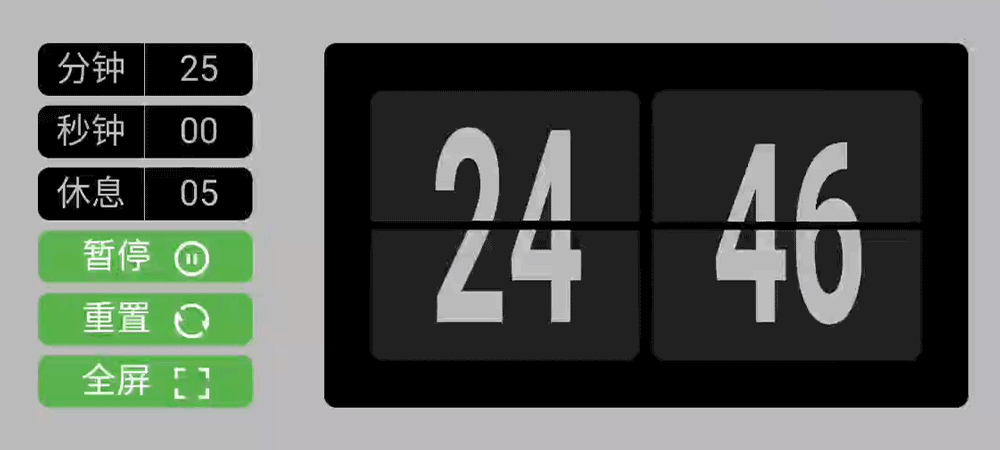

# Tomato-Timer-Web

> 番茄计时器-网页版

# Demo

可以直接打开 GitHub Pages 查看效果：

<https://luckyzhz.github.io/Tomato-Timer-Web/>



## 项目特点

这是一个用 JavaScript 配合 CSS 动画实现的【**翻牌效果**】的倒计时器。

优点：

1. 使用**自定义**的【**自动调整执行间隔的定时器函数**】，可以准确计时。
2. 不会出现跳跃更新（例如，计数板上的数字从 42 直接变成 40）。
3. CSS 动画较为流畅。
4. 运算量小，且基本维持不变。
5. 响应式布局，兼容桌面端和移动端。
6. 在 Chrome 或 Safari 浏览器上运行良好。

## 自调整定时器详解

```js
let timeoutID;  // timeoutID，用于清除定时器

// 自动调整执行间隔的定时器
function adjustingInterval(func, interval) {  // 传入函数和执行间隔
  let expectedTime = Date.now() + interval; // 每次执行的期望时间戳
  timeoutID = setTimeout(step, interval);
  function step() {
    let drift = Date.now() - expectedTime;  // 真正执行时与期望时间戳的漂移
    expectedTime += interval;   // 更新期望的时间戳
    // 调用自身，根据漂移，设置下一个定时任务
    timeoutID = setTimeout(step, Math.max(0, interval - drift));
    func();   // 真正干活的部分。func 注意放在 setTimeout 之后，因为有可能包含 clearTimeout 语句！！！
  }
}
```

上面是 `timer.js` 里我们自己定义的，会自动调整执行间隔的定时器。下图是其执行周期图解：


## 已知 Bug

1. 在 Firefox 中，动画抖动，无法显示出翻牌效果。
2. 如果切换到后台太久，再切回前台，可能每秒钟前后两次计数板更新交织在一起，从而翻牌效果错乱。
   * Windows 10 Chrome 浏览器环境下，一般几秒后会自行调整回来。
   * Android 11 Chrome 浏览器环境下，观察较久，未发现会自行调整回来。

## TODO

1. 全屏时让手机保持亮屏。
2. 息屏或切换到后台时也能保持计时。